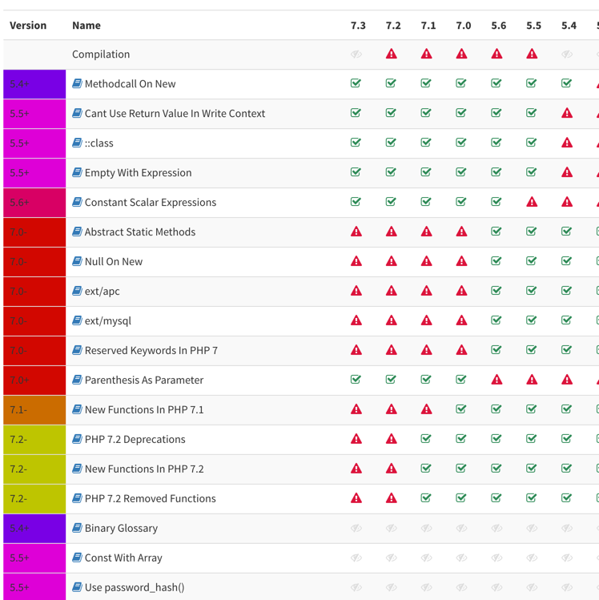
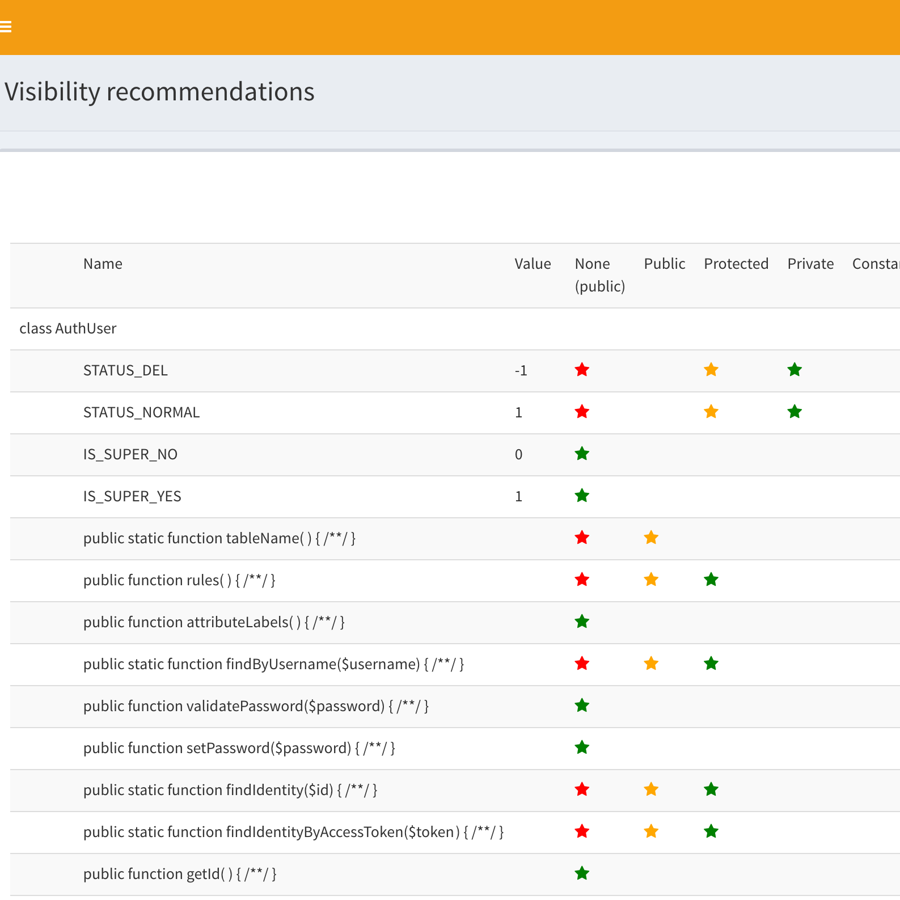
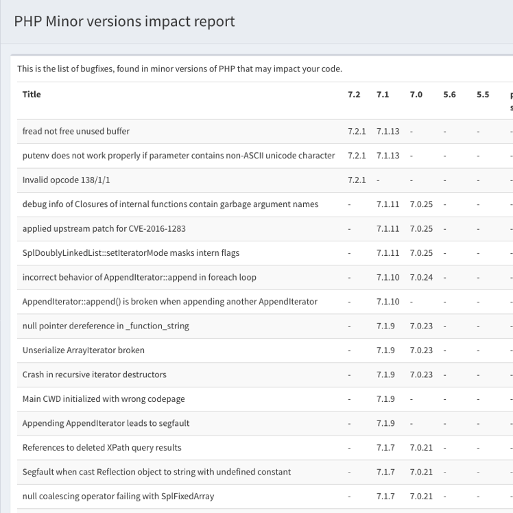
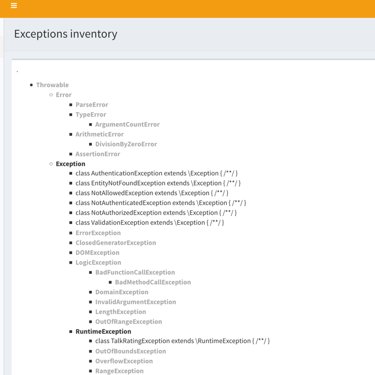

Exakat features
===============

Features list
-------------

-   415 analyzers
-   Compatible with PHP 5.2 to 8.0-dev
-   Migration guide from 5.2 to 7.4 and 8.0-dev
-   Modernize your code
-   List bug fixes for your code
-   appinfo(): the list of PHP features
-   List PHP directives that impact your code
-   Framework and application support
-   Hierarchy Diagrams
-   Code visualizations

415 analyzers
-------------

There are currently 415 different analyzers that check the PHP code to
report code smells. Analyzers are inspired by PHP manual, migration
documents, community good practices, computer science or simple logic.

Some of them track rare occurrences, and some are frequent. Some track
careless mistakes and some are highly complex situations. In any case,
exakat has your back, and will warn you.

Compatible with PHP 5.2 to 8.0-dev
----------------------------------

The Exakat engine audits code with PHP versions that range from PHP 5.2
to PHP 8.0-dev.

The Exakat engine itself runs on PHP 7.x+ and is regularly checked on
those versions. It is possible to run Exakat on 7.2 and audit a code
with PHP 5.6.

Migration guide from 5.2 to 8.0-dev
-----------------------------------

Every middle version of PHP comes with its migration guide from the
manual, and from community\'s feedback. Incompatibilities are included
as analyzers in Exakat, and report everything they can find that may
prevent you from moving to the newer version.

Although they won\'t catch it all, they do reduce the amount of
unexpected surprises by a lot.

Modernize your code
-------------------

Migrations are too often considered over when incompatibilities are
removed. In fact, the best is still to come : using the new features.
Or, using the new features from previous versions, that were forgotten.
Exakat dedicates a whole category of suggestions to modern PHP features
that should be used now.

Bug fixes that impact the code
------------------------------

Every minor version of PHP comes with bug fixes and modifications at the
function level. Some special situations are better handled, and that may
have impact in your code. Every modified function, class, trait or
interface that is also found in your code is reported here, giving a
good overview of the impact of every minor version.

Safe bet : keep up to date!

appinfo(): the list of PHP features
-----------------------------------

Do you know the PHP features that your application rely upon ?
Recursivité, reflexion, backticks or anonymous classes ? Exakat collect
all those features, and sum them up in one nice table, so you know all
of it.

List of significant PHP directives
----------------------------------

Exakat recommends which PHP directives to check while preparing your
code for production. If \'memory\_limit\' is an ever green, may be
\'post\_max\_size\' (linked to file\_upload), or assertions shouldn\'t
be forgotten. Based on feature and extension usage, it also list the
most important directives, and leads you to the full manual list, in
case you want to fine tune it to the max. Use it as a reminder.

Framework and application support
---------------------------------

Exakat provides support for framework and application specific rules.
Supported frameworks includes Cakephp, Codeigniter, Drupal, Laravel,
Melis, Slim, Symfony, Wordpress and Zend Framework

Hierarchy Diagrams
------------------

Exakat documents the code automatically with several diagrams, such as :
\* UML class diagramm, based on inheritance (classes), usage (traits)
and implementations (interfaces), grouped by namespaces. \* The
Exceptions tree \* The traits tree and the trait matrix

Code visualizations
-------------------

Exakat documents the code automatically with several diagrams, such as :
a full UML class diagramm, based on inheritance (classes), usage
(traits) and implementations (interfaces), grouped by namespaces.

