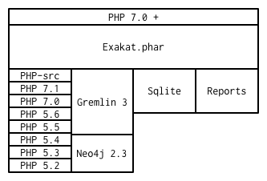

Introduction {#Introduction}
============

This is the documentation of the Exakat engine, version 2.2.0 (Build
1163), on Thu, 15 Oct 2020 16:53:15 +0000.

What is Exakat ?
----------------

Exakat is a tool for analyzing, reporting and assessing PHP code source
efficiently and systematically. Exakat processes PHP 5.2 to 7.4 and 8.0
code, as well as reporting on security, performance, code quality,
migration.

Exakat reads the code, builds an AST and several dependency graphs, then
indexes all of it in a graph database. From there, exakat runs analysis,
collecting potential errors and descriptive information about the code.
Finally, exakat produces reports, both for humans and machines.

Exakat Use Cases
----------------

### Code quality

Exakat detects hundreds of issues in PHP code : dead code, incompatible
calls, undefined calls, illogical expressions, etc. Exakat is built for
PHP, and cover common mistakes.

### PHP version migration

Every PHP middle version is a migration by itself : based on the manual
and common practices, exakat find both backward incompatibilities, that
prevent migration, and new features, that makes code modern.

Exakat review code for minor version, and spot bug fixes that may impact
the code.

### Framework code quality

Common best practices and recommendations for specific plat-forms like
Wordpress, CakePHP or Zend Framework are covered.

### PHP configurations

Exakat detects several specialized analyzes, for Web security : making
the code more secure online; PHP performances : allowing faster
execution.

### Security, performances, testability

Exakat has several specialized analyzes, for Web security : making the
code more secure online; PHP performances : allowing faster execution;
Testability : targeting the common pitfalls that makes code less
testable.

### Feature inventories

When auditing code, it is important to have a global view. Exakat
collects all PHP features (magic functions, any operator, special
functions or patterns) and represents them in one report, giving
auditors a full view.

Exakat inventories all literals for later review, helping with the magic
number syndrome and any data refactoring.

Exakat compared to others
-------------------------

### Code sniffer

Automated coding standard violation detection for PHP review the code
for syntax layout. Exakat is not a coding standard detection tool, as it
focuses on bug finding, rather than coding layout.

While checking for coding standard, some bugs may be detected, and when
checking for bugs, some coding standards may be found too.

Using AST, dependency graphs and knowledge databases, Exakat reviews the
code, checks its potential usage and mis-usage. Exakat doesn\'t take any
presentation nor comments into accounts : only functions, variables and
their effects.

### Phan, PHPstan, PHP

PHP code quality checks, based on type compatibility, and structure
definitions. Exakat shares AST style analysis but it goes a bit further
by including common mistakes and actual PHP features detections.

### PHP7mar, PHP7cc

Code review for PHP 5 to migrate to PHP 7. Exakat covers every middle
version from PHP 5.3 to PHP 7.3.

### PHP-ci, Jenkins, Grumphp

Continuous integration and code quality management check the code by
running code quality tools and collecting all the reported informations.
Exakat is a good companion for those tools.

Exakat provides machine readable format reports, such as json, xml, text
that may be consumed by CI. Exakat provides also human readable format,
such as HTML, for interactive review of the reports, and a longer usage
life span.

Exakat ecosystem
----------------

[Exakat](http://www.exakat.io/) is an Open Source tool. The code is
available on
[Github.com/exakat/exakat](https://github.com/exakat/exakat), as [Docker
image](https://hub.docker.com/r/exakat/exakat/) and [Vagrant
file](https://github.com/exakat/exakat-vagrant). It is also available as
a phar [download](https://www.exakat.io/download-exakat/).

[Exakat cloud](https://www.exakat.io/exakat-cloud/) is a SaaS platform,
offering exakat audits on code, anytime, at reduced cost.

[Exakat SAS](https://www.exakat.io/get-php-expertise/) is a Service
company, providing consulting and training services around automated
analysis and code quality for PHP.

Architecture
------------

Exakat relies on PHP to lint and tokenize the target code; a graph
database to process the AST and the tokens; a SQLITE 3 database to store
the results and produce the various reports.

Exakat itself runs on PHP 7.2, with a short selection of extensions. It
is tested with PHP 7.0 and 7.3.

Source code is imported into exakat using VCS client, like git, SVN,
mercurial, tar, zip, bz2 or even symlink. Only reading access is
actually required : the code is never modified in any way.

At least one version of PHP have to be used, and it may be the same
running Exakat. Only one version is used for analysis and it may be
different from the running PHP version. For example, exakat may run with
PHP 7.2 but audit code with PHP 5.6. Extra versions of PHP are used to
provide compilations reports. PHP middle versions may be configured
separately. Minor versions are not important, except for edge cases.

The gremlin server is used to query the source code. Once analyzes are
all finished, the results are dumped into a SQLITE database and the
graph may be removed. Reports are build from the SQLITE database.
